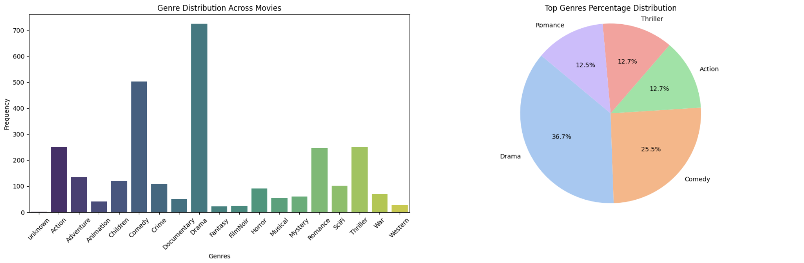
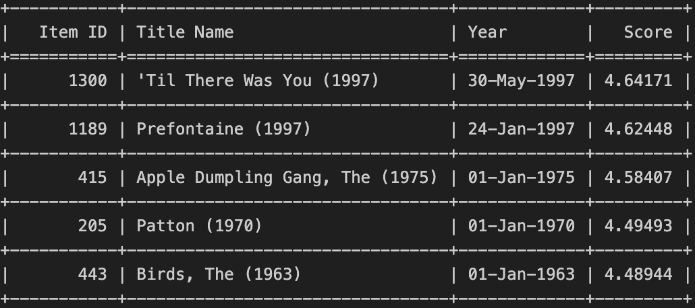

# Introduction
My project focuses on developing a machine learning model that is trained to predict the most appropriate movies for a particular user. This task is faced by many online platforms that want to increase the number of new users and maintain the number of already registered users by personalizing content. My recommendation system model has learned to predict what rating a user would give to a particular movie based on already rated movies, and suggests the user to watch the top k movies they have not watched yet. 

# Data analysis
I used the Movie Lens 100K dataset to develop and train the recommendation system. The dataset includes:

* **Ratings Data (u.data):** A full dataset of 100000 ratings by 943 users on 1682 items.
* **Movie data (u.item):** Information about the items (movies). This is a tab separated list of movie id, movie title, release date, video release date, IMDB URL, and genres.
* **User Data (u.info):** Demographic information about the users. This is a tab separated list of user id, age, gender, occupation, zip code.

### u.data
Firstly, I deleted nan values, if they exist. I then deleted those movies that had less than 5 ratings on them so that I wouldn't recommend them to users later. 

### u.item
Firstly, I deleted nan values, if they exist. Then I removed columns such as `title`, `release_date` and `url` as they would not be needed to train the model. I also deleted the `timestamp` colocation, replacing it with the `year` and `month` of the movie's release. \
After looking at the genre distribution, I decided to remove movies with no genre so as not to predict them to users. 

In evaluating the movie release date distributions, I saw that there are far fewer movies in the dataset that were released earlier than 1980. However, taking the number of all movies from these years, I decided to remove only movies released earlier than 1930. 

### u.info
Firstly, I deleted nan values, if they exist. I then deleted `zipcode` because I felt that this column was not useful in training the model. I also replaced the gender with F = 0, M = 1. I then looked at the age distribution and noticed that there are only 36 children and 907 adults in my dataset, however I did not remove children because they heavily influence the `comedy`, `children` and `fantasy` genres. 

# Model Implementation
## Introduction
The implemented model is an Embedding Recommender System designed to provide personalized recommendations for users based on their interactions with items. The model employs embeddings to represent users and items in a lower-dimensional space, capturing latent features that contribute to the recommendation process. This report aims to provide an overview of the model architecture, key components, and potential areas for improvement.

## Model Components
### RecommenderDataset
The RecommenderDataset class serves as the dataset handler for the recommender system. It takes a DataFrame as input and converts it into a PyTorch dataset. The dataset only contains the raw numerical values from the DataFrame. The `__getitem__` method returns a PyTorch tensor representing the data at a given index.

### EmbeddingRecommenderModel
The EmbeddingRecommenderModel class is the core of the recommendation system. It consists of the following components:

#### Embedding Layers
 Utilizes two embedding layers for users and items, where the size of each embedding is specified by the embedding_size parameter. These layers are responsible for capturing latent features.

#### Fully Connected Layers
Employs two fully connected layers (fc1 and fc2) for learning complex relationships between user-item embeddings and additional features. The first layer is followed by batch normalization (bn1) and rectified linear unit activation (relu1).

#### Forward Pass
The forward method takes user and item IDs along with additional user and item features as input. It performs the following steps:

* Embeds user and item IDs using the corresponding embedding layers.
* Concatenates the user and item embeddings with additional user and item features.
* Passes the concatenated input through a fully connected layer (fc1) followed by batch normalization and ReLU activation.
* Feeds the result through another fully connected layer (fc2) to produce the final recommendation score.

# Model Advantages and Disadvantages
### Model Advantages
* **Embedding Representation:** The use of embedding layers allows the model to learn a low-dimensional representation of users and items, capturing latent features that contribute to the recommendation process. This can lead to more meaningful and interpretable representations.

* **Flexibility:** The model is flexible and can handle different types of user and item features by concatenating them with the embeddings. This flexibility makes it suitable for a wide range of recommendation tasks.

* **Interpretability:** The model architecture, with explicit embedding layers and fully connected layers, provides some level of interpretability. It allows stakeholders to understand the importance of different features in the recommendation process.

* **Scalability:** Embedding-based models are often more scalable than traditional collaborative filtering approaches, especially as the number of users and items grows, because they efficiently capture relationships in a lower-dimensional space.

* **Customization:** The model allows for easy customization by adjusting hyperparameters such as embedding size, the number of hidden units, and other architectural components. This enables tailoring the model to specific use cases and datasets.

### Model Disadvantages
* **Cold Start Problem:** The model may struggle with the cold start problem, where it is challenging to provide accurate recommendations for new users or items that have limited interaction history. Embeddings for new entities may not be well-learned.

* **Data Sparsity:** In scenarios with sparse data, where users have interacted with only a small subset of items, the model might struggle to learn meaningful embeddings for all entities, potentially leading to suboptimal recommendations.

* **Lack of Diversity:** The model might be prone to suggesting popular items to a wide range of users, potentially leading to a lack of diversity in recommendations.

# Training Process
Training Process for Embedding Recommender System
The training process for the Embedding Recommender System involves the following steps:

### Initialization
The recommender system is initialized with the necessary parameters such as the dataset, batch size, learning rate, number of epochs, and validation split. The model architecture is defined using the EmbeddingRecommenderModel class, and the Adam optimizer is employed for parameter optimization with mean squared error loss (nn.MSELoss).

### Dataset Splitting
The dataset is split into training and validation sets using train_test_split. The training set is used to train the model, while the validation set is employed for evaluating the model's performance and preventing overfitting.

### Training Loop
The training loop consists of iterating over the specified number of epochs. For each epoch:

### Training Phase
The model is set to training mode (self.model.train()).
The training dataset is loaded using a PyTorch DataLoader with shuffled batches.
For each batch, the model performs a forward pass, calculates the mean squared error loss, and updates the model's parameters through backpropagation using the Adam optimizer.
Training loss for the epoch is calculated and stored.
* **Validation Phase:**
The model is set to evaluation mode (self.model.eval()).
The validation dataset is loaded using a PyTorch DataLoader.
For each batch, the model performs a forward pass without updating parameters, and the validation loss is calculated.
Validation loss for the epoch is calculated and stored.
* **Model Checkpoint:**
If the current validation loss is lower than the best validation loss observed so far, the model parameters are saved as a checkpoint. This helps in retaining the best model configuration.
* **Monitoring Progress:**
The training and validation losses for each epoch are printed to monitor the training progress.
### Visualization
After training, the training and validation losses are plotted to visualize the model's learning curve over epochs.

### Prediction and Recommendation
The trained model can be used to predict top-k recommendations for a given user using the predict_top_k method. The print_recommendations method prints the top-k recommendations, filtering out items the user has already rated.

### Usage
The entire training process is encapsulated within the RecommenderSystem class. After instantiating an object of this class with the dataset, the train method is called to train the model. Finally, the print_recommendations method can be used to generate and display personalized recommendations for a specific user.

### Conclusion
This training process enables the model to learn meaningful embeddings and relationships between users, items, and additional features, leading to improved recommendations over the course of the training epochs. 

# Evaluation
Evaluation of Recommender System
The evaluation process for the recommender system involves assessing its performance on three different datasets: training, validation, and test sets. The evaluation metrics primarily focus on Mean Squared Error (MSE). 

* **Training Evaluation:**
Training evaluation assesses the model's performance on the training set, measuring how well it fits the training data. This evaluation is essential to monitor the model's ability to learn from the provided data during the training process. However, it is not a definitive measure of the model's generalization capabilities.

* **Validation Evaluation:**
Validation evaluation is performed on a separate dataset that the model has not seen during training. This set is used to tune hyperparameters, prevent overfitting, and select the best-performing model. The Mean Squared Error on the validation set is monitored during training epochs.

* **Test Evaluation:**
Test evaluation provides a final assessment of the model's generalization performance on an entirely unseen dataset. The test dataset is never used during the training or validation phases and serves as an independent benchmark for evaluating the model's effectiveness in making predictions on new data.

Epoch 7/7, Training Loss: 0.03527068829819982, \
Validation Loss: 0.03713397555728368, \
Mean Squared Error on Test Set: 0.041384320706129074

# Results
Thus, my model is trained to predict the top k movies and produce a preliminary score for each movie. The following are examples of the top unviewed movies of users. \
Top 10 films for user_id = 500:
\
Top 3 films for user_id = 15:
\
Top 5 films for user_id = 69:
